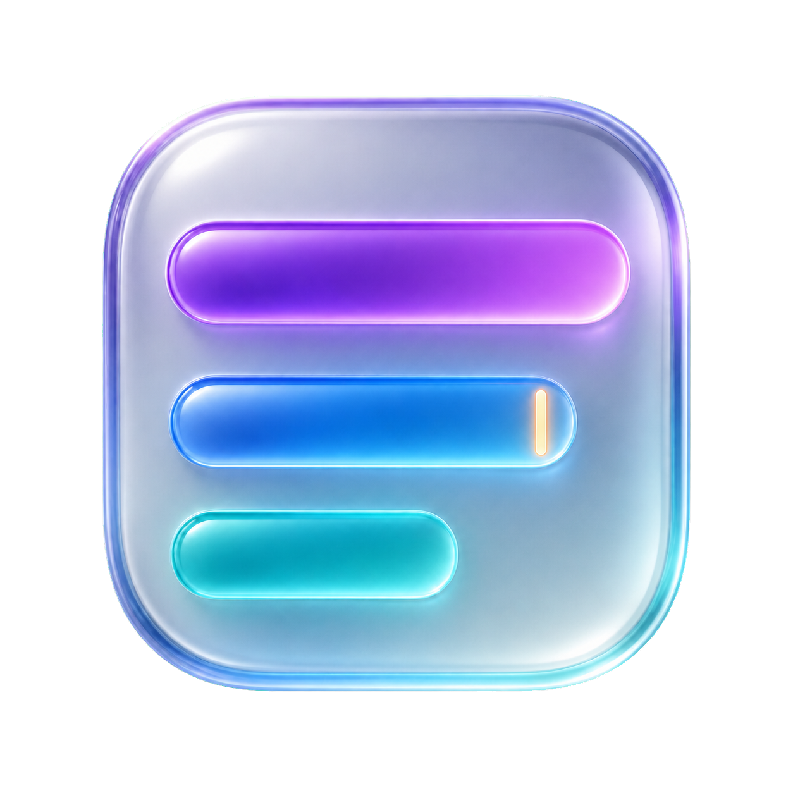

<p align="center">
  
</p>

<h1 align="center">QuotaGlass</h1>

<p align="center">
  AI agent usage at a glance.
</p>

<p align="center">
  A quiet, always-available macOS widget for monitoring Claude Code and Codex
  usage without leaving your workflow.
</p>

## What is QuotaGlass?

QuotaGlass lives in the macOS menu bar and keeps the usage limits that matter
close at hand. Its provider-neutral foundation presents Claude Code and Codex
through one consistent interface, with room for more agents over time.

- Switch between Claude Code and Codex from the widget or a global shortcut.
- Move between super compact, compact, and detailed views.
- See live quota windows, reset times, and last-known-good data.
- Inspect local activity, sessions, tool calls, and model output in the
  detailed view.
- Keep it out of the way with no Dock icon or Cmd+Tab entry.
- Snap the widget to any display corner and restore its position on launch.

## Global shortcuts

Shortcuts remain available across macOS while QuotaGlass is running and are
unregistered when the app quits.

| Action                  | Shortcut                   |
| ----------------------- | -------------------------- |
| Switch provider         | `Control+Option+P` (`⌃⌥P`) |
| Cycle view              | `Control+Option+V` (`⌃⌥V`) |
| Show or hide QuotaGlass | `Command+Shift+U` (`⇧⌘U`)  |

The provider name and view controls in the widget remain clickable too.

## Data and privacy

QuotaGlass talks directly to the tools already authenticated on your Mac.

### Claude Code

- Reads Claude Code's local stats cache and session JSONL files.
- Fetches quota windows from Anthropic's OAuth usage endpoint using the Claude
  Code credential stored in macOS Keychain.

### Codex

- Maintains one local `codex app-server` process and calls its stable
  `account/rateLimits/read` and `account/usage/read` methods.
- Reads local Codex session JSONL files for metadata-only details such as
  prompt, session, tool, and output-token counts.
- Never reads or stores prompt text, response text, or Codex authentication
  files.

Both providers retain last-known-good quota data so a transient account or
network error does not immediately blank the widget.

## Requirements

- macOS 13 or newer
- Claude Code and/or Codex authenticated locally
- Node.js 24.18.0 (pinned in `.nvmrc`), Corepack, and the Rust toolchain

## Development

Install dependencies and start the Tauri development app:

```bash
corepack enable
pnpm install
pnpm tauri dev
```

Run the frontend build and Rust tests:

```bash
pnpm build
cargo test --manifest-path src-tauri/Cargo.toml
```

Build, install, and relaunch the app at `~/Applications/QuotaGlass.app`:

```bash
pnpm ship
```

To build the macOS app bundle without installing it:

```bash
pnpm tauri build --bundles app
```

## Project structure

- `src/` — provider-neutral React UI and persisted provider/view state
- `src-tauri/src/providers/` — provider integrations and shared response types
- `src-tauri/src/codex_rpc.rs` — persistent Codex app-server JSON-RPC client
- `src-tauri/src/lib.rs` — Tauri commands, shortcuts, tray, placement,
  filesystem watchers, and login item
- `assets/brand/` — approved QuotaGlass app and menu-bar brand assets
- `scripts/deploy.sh` — one-step build, install, and relaunch

## Contributing

Issues and pull requests are welcome. Please keep provider-specific behavior
behind the normalized provider boundary and preserve the lightweight,
glanceable character of the widget.
